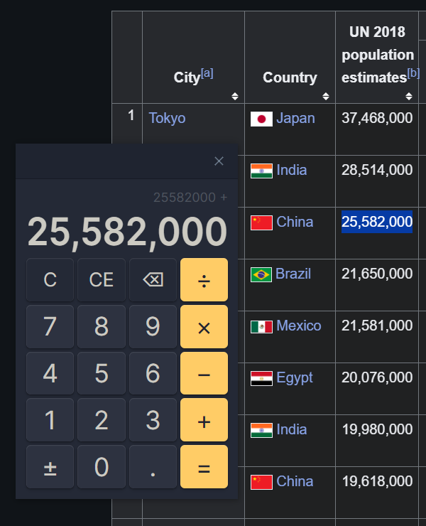

# Calculite

A standard calculator for doing simple maths in Obsidian, like adding up shopping lists, subtracting from countdowns, multiplying your gym reps, or dividing up averages. More convenient than switching to your system calculator, especially on mobile!

Supports any version of Obsidian all the way back to [`0.13.30`](https://obsidian.md/changelog/2022-03-07-desktop-v0.13.30/).

> ⤿ Desktop users can toggle a floating calculator that works anywhere on your computer.

## How to use

Calculite works like most other desktop calculators. There's no calculation history, but clipboard operations are supported, and the plugin will remember your current equation even if you close and relaunch Obsidian, as long as you don't close the calculator tab.

There are three different ways to open the calculator:

1. The ribbon icon
2. The **Show calculator** command
3. The **Toggle between sidebars** command
4. The **Toggle floating calculator** command

Commands are accessible from the [command palette](https://help.obsidian.md/plugins/command-palette). **Show calculator** creates a calculator tab, or reveals an existing one, and the **Toggle** commands switch the calculator between different positions.

## Hotkeys

Calculite supports most hotkeys used by the Windows and macOS calculators:

| Button      | Hotkeys                       | Extra Hotkeys                             |
| ----------- | ----------------------------- | ----------------------------------------- |
| Clear       | <kbd>C</kbd>                  | <kbd>Escape</kbd>                         |
| Clear Entry | <kbd>Del</kbd>                | <kbd>⇧ Shift</kbd> + <kbd>Escape</kbd>    |
| Delete      | <kbd>Backspace</kbd>          | <kbd>⇧ Shift</kbd> + <kbd>Backspace</kbd> |
| Numerals    | <kbd>0</kbd>–<kbd>9</kbd>     |                                           |
| Decimal     | <kbd>.</kbd>                  | <kbd>,</kbd> (region-specific)            |
| Negate      | <kbd>Alt</kbd> + <kbd>-</kbd> | <kbd>F9</kbd>                             |
| Add         | <kbd>+</kbd>                  | <kbd>P</kbd>                              |
| Subtract    | <kbd>-</kbd>                  | <kbd>O</kbd>                              |
| Multiply    | <kbd>*</kbd>                  | <kbd>T</kbd> or <kbd>X</kbd>              |
| Divide      | <kbd>/</kbd>                  | <kbd>Y</kbd>                              |
| Equals      | <kbd>=</kbd>                  | <kbd>Enter</kbd>                          |

## Etymology

- **calx:** *Latin for limestone or chalk.*
- **-ulus:** *A suffix meaning small in size.*
- **-ite:** *A suffix used to denote rocks, minerals or fossils.*

## License

This plugin is released under an [MIT No Attribution](https://choosealicense.com/licenses/mit-0/) license, which means you're free to modify and share its source code without needing to credit the author (me). It also protects the code author from liability for damages, so I recommend using a similar license if you republish this code.